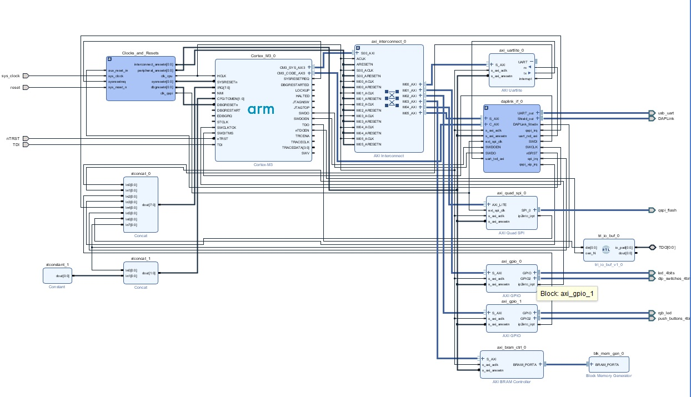
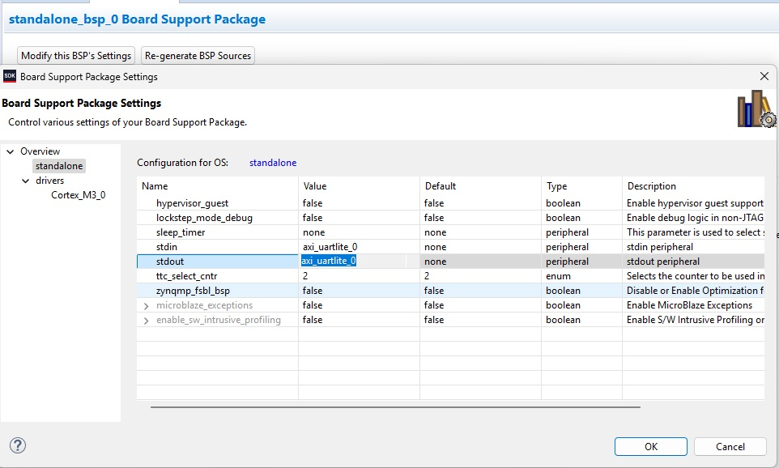
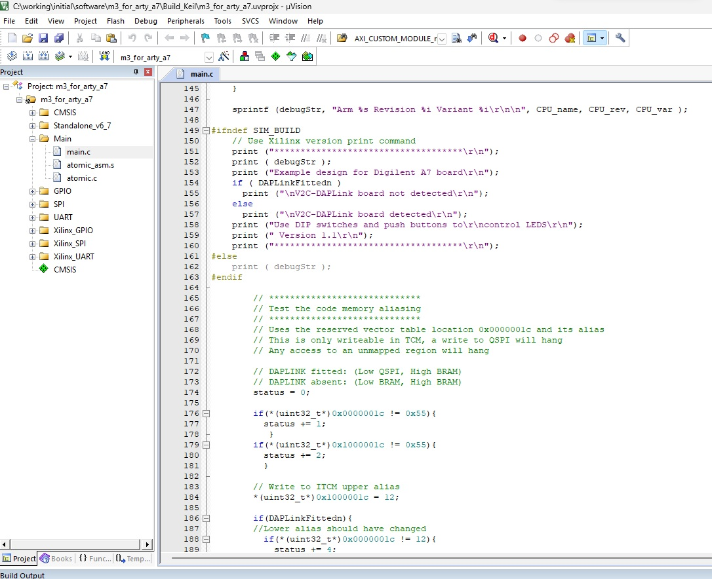

# Usage of the ARM Cortex M3 on a SHA3-512 Design

### Official example with ARTY A7 35T board:

 [Arm Cortex-M3 DesignStart FPGA-Xilinx edition User Guide](https://developer.arm.com/documentation/101483/0000?lang=en)<br>


### Objectives:
1.  Set up the Arm Cortex-M3 example design, use the Xilinx tools to compile it into a new bitstream file.
2.  Test out the Arm Keil toolflow, verify that we can compile Cortex-M3 example firmware.
3.  Test that we can merge our compiled firmware into our new bitstream and load successfully onto the Arty.
4.  Add source code libraries and compile in Keil.
5.  Add RX/TX capabilities to the original UART IP block.
6.  Modify original Design to add a SHA3-512 IP block and an AXI Timer.
7.  Interface with a serial external application.

### Prerequisite:
1. Register at ARM and download the Cortex M3 models from https://developer.arm.com/downloads/view/AT426
2. Digilent Board files from https://github.com/Digilent/vivado-boards/archive/master.zip
3. Register and download Keil:https://developer.arm.com/Tools%20and%20Software/Keil%20MDK
(Optional)
4. Micron flash memory model:  https://media-www.micron.com/-/media/client/global/documents/products/sim-model/nor-flash/serial/bfm/n25q/n25q128a13e_3v_micronxip_vg12,-d-,tar.gz?rev=0aafb8ea0b03403084d8967562251fd9
5. Download Cypress flash memory model:  https://www.cypress.com/verilog/s25fl128s-verilog


### Instructions:
1. Download install Xilinx Vivado 2019.1 from Xilinx, install webpack edition.
2. Decompress ARM M3 Cortex M3 into C:\FPGA rename to arm_cortex_m3


3. Decompress master.zip and copy the Digilent board files into C:\Xilinx\Vivado\2019.1\data\boards\board_files

*** (Optional)

4. Decompress Micron Flash Memory model into [ProjectDirectory]\hardware\m3_for_arty_a7\testbench
5. Rename to Micron_N25Q128A13E
6. Copy file <br>[ProjectDirectory]\hardware\m3_for_arty_a7\testbench\Micron_N25Q128A13E\sim\sfdp.vmf<br>
   into [ProjectDirectory]\hardware\m3_for_arty_a7\testbench<br>
7. Decompress the Cypress flash memory zip file and execute the binary file.
8. Execute the installer and point it at [ProjectDirectory]\hardware\m3_for_arty_a7\testbench\S25fl128s


###  Synthesis Flow:
1.   Start by testing the ARTY A7 100T board connection to the Host
1.   Connect the ARTY A7 100T board to the Host computer using usb cable
2.   Set up a serial connection at 115200 bps, 8 bits parity, 1 stop     bit, Parity None, Xon/Xoff flow.
3.   At the serial console you should see the default image loaded:
     
    ********************************************************
    ********************************************************
    **        Avnet/Digilent Arty Evaluation Board        **
    **        LEDs and switches GPIO Demonstration        **
    ********************************************************
    ********************************************************
    **
    Choose Task:
    BTN0: Print PWM value.
    BTN1: 'Cylon' LED display.
    BTN2: Scrolling LED display.
    BTN3: Return to this menu.

1.   Open [ProjectDirectory]/hardware/m3_for_arty_a7/m3_for_arty_a7/m3_for_arty_a7.xpr
     (When opening for the first time, if the optional libraries are not installed, you may get 3 errors. (ignore))
     click OK.
2.   In the flow Navigator, under IP Integrator, click Open Design Block, 

    

2.   Under Project Manager -> Settings, change project device to use the board you are going to use, in my case: (xc7a100ticsg324-1)
3.   Also under Settings->IP->Repository validate that the vivado/Arm_ipi_repository is selected.


4.   Under Flow Navigator->Implementation, Click on Run Generate Bitstream. (It will run synthesis, implementation and will generate the
     BitStream file)

(Optional)
5.   Open Hardware Manager, connect your FPGA board to the serial console and program device with the Bitstream generated.


        ************************************
        Arm Cortex-M3 Revision 1 Variant 2

        Example design for Digilent A7 board

        V2C-DAPLink board not detected
        Use DIP switches and push buttons to
        control LEDS
        Version 1.1
        ************************************
        Aliasing OK
        Bram readback correct
        Base SPI readback correct
        Atomic transaction test completed

### Modifying the Software Image

1. Go back to Vivado and under Flow Navigator->Implementation , Click on Open Synthesized Design.
2. In Windows, open a new explorer window and go to: [ProjectDirectory]\hardware\m3_for_arty_a7\m3_for_arty_a7, edit  make_mmi_file.tcl,
   change: 
   
   set part:"xc7a35ticsg324-1L"   for: set part     "xc7a100tcsg324-1"

3. In the lower pane, under TCL console, update the m3.mmi file, by running the following command:<br>

	```source make_mmi_file.tcl```<br>

4. Select File->Export->Export Hardware, Set "Exported location" to V:\software
5. Select File->Launch SDK, set "Workspace" to V:/software/m3_for_arty_a7/sdk_workspace
6. In SDK window, Select Xilinx->Repositories and set to  V:\vivado\Arm_sw_repository is listed under "Global Repositories"
7. Select File->New->Board Support Package, click Ok with default values, Change the OS Version to 6.7, Click OK
8. Click "Modify this BSP's Settings", go to "standalone" tab, Change Value column for stdin and stdout to be "axi_uartlite_0" and Press "OK"

    

9. Copy files xpseudo_asm_rvct.c and xpseudo_asm_rvct.h, ..\vivado\Arm_sw_repository\CortexM\bsp\standalone_v6_7\src\arm\cortexm3\armcc
to ..\software\m3_for_arty_a7\sdk_workspace\standalone_bsp_0\Cortex_M3_0\include
10. Go to ..\software\m3_for_arty_a7\Build_Keil, Double-click m3_for_arty_a7.uvprojx

    

10. Modify the main.c file

    ```print ("CHANGES TO TEST ARTY A7 100\r\n");```<br>

11. Select Project->Rebuild All Target Files
12. Open a CMD window on v:\hardware\m3_for_arty_a7\m3_for_arty_a7, Run script make_prog_files.bat
13. Once new bitstream file is generated, program the board.


        Arm Cortex-M3 Revision 1 Variant 2

        Example design for Digilent A7 board

        V2C-DAPLink board not detected
        Use DIP switches and push buttons to
        control LEDS
        Version 1.1
        CHANGES TO TEST ARTY A7 100
        ************************************
        Aliasing OK
        Bram readback correct
        Base SPI readback correct
        Atomic transaction test completed


